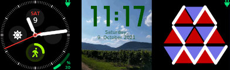
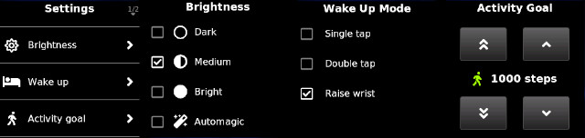
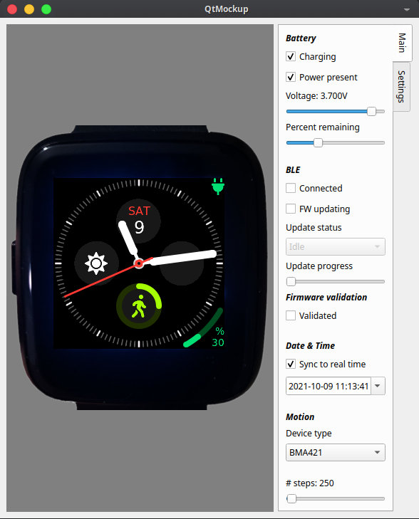

# B3yondTime

This is a fork of the [InfiniTime](https://github.com/InfiniTimeOrg/InfiniTime) firmware for
the [Pinetime smartwatch](https://www.pine64.org/pinetime/).

## What's this fork about?

While maintaining most of the "under the hood" machinery of
[InfiniTime](https://github.com/InfiniTimeOrg/InfiniTime), this fork changes the way the display
application works in significant ways:

 - It decouples the display implementation from the base system by using interfaces and
   a container class for the device's controllers and drivers.
 - The way a user interacts with the display is defined using a screen graph which contains
   all possible transitions between the screens and the triggers of these transitions.
 - It comes with a specific base class for watch faces, which simplifies the development of
   new watch faces by providing ready-to-use common functionality such as handlers for time
   and date change events, widget creation helper functions, etc.
 - A Qt mockup project is provided which allows for easy development of new screens. It
   provides mockups for most of the controllers and the system interface, so that you can
   share the very same screen source files between the Qt application and the actual firmware.

## Overview

### Watch faces

At the moment there are three watch faces: analog, digital and binary.

### Settings

Screens have been implemented for setting the brightness, the display wake up modes and the
activity goal (steps per day).

### Mockup

New screens can be developed in the Qt mockup project. Swiping, tapping and pushing the side
button can be simulated using the mouse.

The mockup provides GUI elements to simulate different inputs of the watch's controllers.
That way, you can properly test the behavior of new screens before embedding them into the
firmware.

## The clockwork

The inner workings of the firmware are shared with
[InfiniTime](https://github.com/InfiniTimeOrg/InfiniTime):

 - Build system based on **CMake**;
 - Based on **[FreeRTOS 10.0.0](https://freertos.org)** real-time OS.
 - Using **[LittleVGL/LVGL 7](https://lvgl.io/)** as UI library...
 - ... and **[NimBLE 1.3.0](https://github.com/apache/mynewt-nimble)** as BLE stack.

## Companion apps

To get the most out of your [Pinetime smartwatch](https://www.pine64.org/pinetime/), you can
use a companion app which acts as a data provider for the watch.

 - [Gadgetbridge](https://codeberg.org/Freeyourgadget/Gadgetbridge/) (on Android via F-Droid)
 - [Amazfish](https://openrepos.net/content/piggz/amazfish) (on SailfishOS and Linux)
 - [Siglo](https://github.com/alexr4535/siglo) (on Linux)
 - **[Experimental]** [WebBLEWatch](https://hubmartin.github.io/WebBLEWatch/) Synchronize time directly
   from your web browser. [video](https://youtu.be/IakiuhVDdrY)
 - **[Experimental]** [Infini-iOS](https://github.com/xan-m/Infini-iOS) (on iOS)

## Documentation

### Introduction

 - [Getting started with InfiniTime 1.0](doc/gettingStarted/gettingStarted-1.0.md)
 - [Flash, upgrade (OTA), time synchronization,...](doc/gettingStarted/ota-gadgetbridge-nrfconnect.md)
 - [Bootloader](https://github.com/JF002/pinetime-mcuboot-bootloader) based on
   [MCUBoot](https://www.mcuboot.com)

### TODO - Development

to be continued...

### Build, flash and debug

 - [Project branches](doc/branches.md)
 - [Versioning](doc/versioning.md)
 - [Files included in the release notes](doc/filesInReleaseNotes.md)
 - [Build the project](doc/buildAndProgram.md)
 - [Flash the firmware using OpenOCD and STLinkV2](doc/openOCD.md)
 - [Build the project with Docker](doc/buildWithDocker.md)
 - [Build the project with VSCode](doc/buildWithVScode.md)
 - [Bootloader, OTA and DFU](./bootloader/README.md)
 - [Stub using NRF52-DK](./doc/PinetimeStubWithNrf52DK.md)
 - Logging with JLink RTT.
 - Using files from the releases

### Contribute

 - [How to contribute ?](doc/contribute.md)

### API

 - [BLE implementation and API](./doc/ble.md)

### Architecture and technical topics

 - [Memory analysis](./doc/MemoryAnalysis.md)

### Using the firmware

 - [Integration with Gadgetbridge](doc/companionapps/Gadgetbridge.md)
 - [Integration with AmazFish](doc/companionapps/Amazfish.md)
 - [Firmware update, OTA](doc/companionapps/NrfconnectOTA.md)

## Licenses

This project is released under the GNU General Public License version 3 or, at your option, any later version.

It integrates the following projects:
 - RTOS : **[FreeRTOS](https://freertos.org)** under the MIT license
 - UI : **[LittleVGL/LVGL](https://lvgl.io/)** under the MIT license
 - BLE stack : **[NimBLE](https://github.com/apache/mynewt-nimble)** under the Apache 2.0 license
 - **TODO**: Add license of fonts

## Credits

All the credits go to the contributors of [InfiniTime](https://github.com/InfiniTimeOrg/InfiniTime). :)

